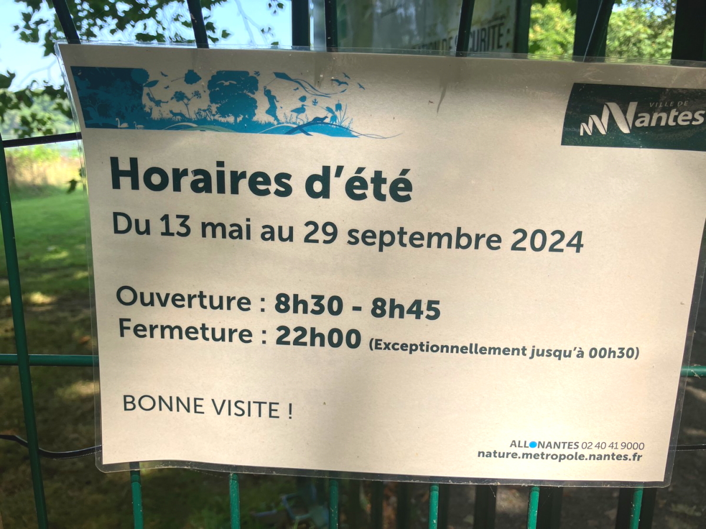
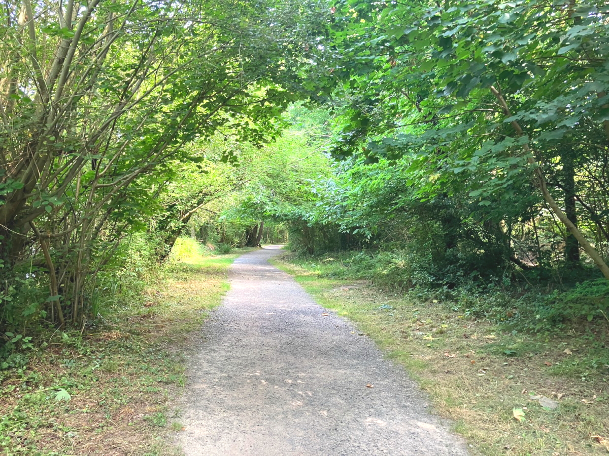
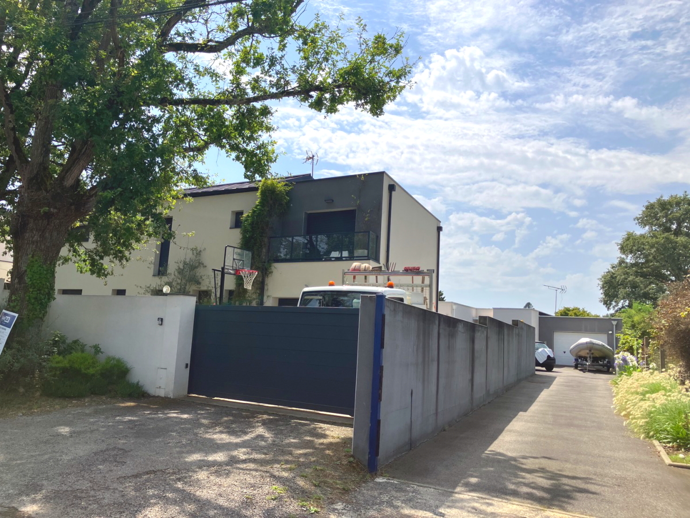
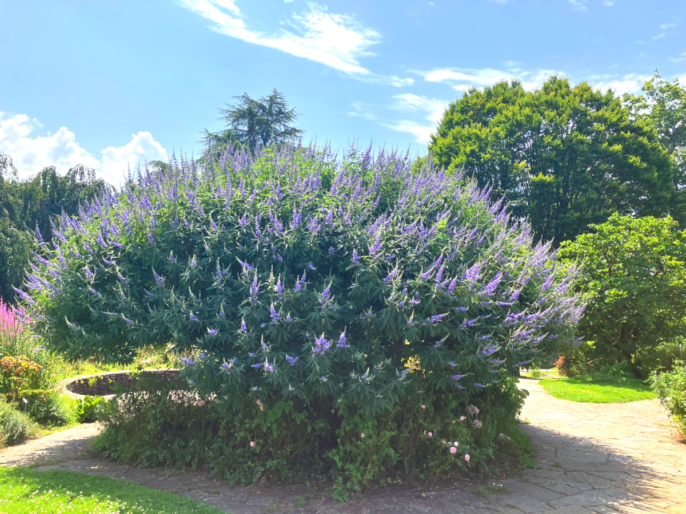

# 2024_paris9

<html lang="ja">
 <head>
  <meta charset="utf-8" />
 

<link href="https://cdnjs.cloudflare.com/ajax/libs/lightbox2/2.7.1/css/lightbox.css" rel="stylesheet">
   
</head>
<!--
<body onload="alert('65歳まで、よく頑張りました！　まだまだ元気に〜〜(^o^)/')" onunload="alert('再会の時まで、元気でお過ごしくださいませ〜(^o^)/')">
-->

  モバイル端末をお使いの場合は、画面を横向きにするとより見やすくご覧頂けます。

<!--
-->

<a href="https://torokoid.github.io/2024_paris/">2024年7月19日〜21日</a>><a href="https://torokoid.github.io/2024_paris2/">22日〜23日</a>><a href="https://torokoid.github.io/2024_paris3/">23日〜24日</a>><a href="https://torokoid.github.io/2024_paris4/">24日〜</a>><a href="https://torokoid.github.io/2024_paris5/">25日〜</a>><a href="https://torokoid.github.io/2024_paris6/">26日〜></a>><a href="https://torokoid.github.io/2024_paris7/">27日〜</a>><a href="https://torokoid.github.io/2024_paris8/">29日〜</a>>31日〜
<!--
-->

 &nbsp;Bruce 31日〜

<!--
<h2><a href="https://torokoid.github.io/list">クラス会名簿リンク</a></h2>
-->
  

 アクセス用QRコード

  

<marquee direction="right" scrollamount="20" width="30%">(^_^)/~hada</marquee>

<h2><marquee behavior="left">!!! 2024年7月29日、ナントでのプチ観光とサッカー観戦 !!!</marquee></h2>
<!--

-->
<!--
<h3> ～～～2024年7月25日着の画像です！～～～  </h3>
-->          

<h3> 日本対ナイジェリア 
ガラガラ 
炎天下なので客が日陰に避難 </h3>

<h2><marquee behavior="left">!!! 7/31ナントの朝は涼しく散歩にでる !!!</marquee></h2>

<h3> ～～～エルドル川の辺り到着～～～  </h3>

<h3> ～～～川沿いの道を進むと公園。少し日本風？～～～  </h3>

<h3> ～～～さらに川を登る～～  </h3>

<h3> ～～～森を抜けると住宅地～～～  </h3>

<h3> ～～～ボート～～～  </h3>

<h3> ～～～暑くなってきたので戻る～～～  </h3>

<h3> ～～～公園の松の枝ぶりが良い～～～  </h3>

<h3> ～～～公園の中を横切りながら戻る～～～  </h3>

<h3> アパートでシャワー浴びて 
遅めのランチをとり、日本女子対ナイジェリアを見に行く  </h3>

<h3> 大味な試合。準々決勝は 
男子スペイン、女子USA  
日本サッカーオリンピック代表は巡る旅も、そろそろ佳境  </h3>

<!--

<h3> いつもありがとうございます。 
日本対ブラジル@パリはチケット完売で見ていません。 
ナントで男子女子の3戦目があるのでナントに先に入り、スペイン対ナイジェリアを観戦。 
翌日の昼、食料を買いに出たら32度。日本並みに暑い。 
男女ともにグループステージ進出が濃厚。 
男子は1位通過確実 
8/2 17:00 Lyon 
8/3女子は1位通過はない 
2位通過21:00ナント 
3位通過15:00パリbr> </h3>

-->

      

                             

                             
        

  

 

<!-- フッタ -->
 <footer>
 <h3>Copyright 2024/Aug/01 S.Hada</h3>
 </footer>
